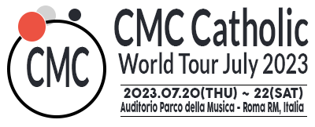

<a name="readme-top"></a>

<div align="center">
   
  <br/>
  <h1><b>Catholic Music Concert - United by the same Faith</b></h1>

</div>

# 📗 Table of Contents 

- [📖 About the Concert](#about-project)
  - [🛠 Built With](#built-with)
    - [Tech Stack](#tech-stack)
    - [Key Features](#key-features)
    - [Walkthrough to the Concert Page](#key-features)
  - [🚀 Live Demo](#live-demo)
- [💻 Getting Started](#getting-started)
  - [Setup](#setup)
  - [Prerequisites](#prerequisites)
  - [Install](#install)
  - [Usage](#usage)
  - [Run tests](#run-tests)
  - [Deployment](#triangular_flag_on_post-deployment)
- [👥 Authors](#authors)
- [🔭 Future Features](#future-features)
- [🤝 Contributing](#contributing)
- [⭐️ Show your support](#support)
- [🙏 Acknowledgements](#acknowledgements)
- [📝 License](#license)


# 📖 [Catholic Music Concert] <a name="about-project"></a>

**[Larry Villegas Portfolio]** is a portfolio with a works as a developer

## 🛠 Built With <a name="built-with"></a>

### Tech Stack <a name="tech-stack"></a>

<details>
  <summary>Client</summary>
  <ul>
    <li><a href="https://code.visualstudio.com/">HTML</a></li>
    <li><a href="https://www.w3.org/standards/">CSS</a></li>
  </ul>
</details>
  
### Key Features <a name="key-features"></a>

**Enlist skill sets and tech stack**
- Responsive design
- Mobile First methodology
- Walkthrough to the [Concert Page](https://www.loom.com/)

<p align="right">(<a href="#readme-top">back to top</a>)</p>

## 🚀 Live Demo <a name="live-demo"></a>

Click <a href="https://larryivc.github.io/EventPage/">here</a> to live demo versión.

<p align="right">(<a href="#readme-top">back to top</a>)</p>

## 💻 Getting Started <a name="getting-started"></a>

To get a local copy up and running follow these simple example.

### Prerequisites

In order to run this project you need:

  * Visual Studio Code
  * Browser [Chrome]
  * Linters

### Setup

Clone this repository to your desired folder:

Example commands:

```sh
  cd my-folder
  git git@github.com:LarryIVC/EventPage.git
```
### Install

Install this project with:

Example command:

```sh
  npm install --save -dev
```
### Usage

To run the project, execute the following command:

Example command:

```sh
  npm start
```

<p align="right">(<a href="#readme-top">back to top</a>)</p>

<!-- AUTHORS -->

## 👥 Authors <a name="authors"></a>

👤 ** Larry Villegas **

- GitHub: [@LarryIVC](https://github.com/LarryIVC)
- Twitter: [@LarryVillegas](https://twitter.com/LarryVillegas)
- LinkedIn: [LinkedIn](https://www.linkedin.com/in/larry-villegas-26216b259/)

<p align="right">(<a href="#readme-top">back to top</a>)</p>

<!-- CONTRIBUTING -->

## 🤝 Contributing <a name="contributing"></a>

Contributions, issues, and feature requests are welcome!

Feel free to check the [issues page](https://github.com/LarryIVC/portfolio/issues).

<p align="right">(<a href="#readme-top">back to top</a>)</p>

<!-- SUPPORT -->

## ⭐️ Show your support <a name="support"></a>

Help me with your criticisms and your suggestions, you will be blessed for such a noble gesture and give me a [⭐️](https://github.com/LarryIVC/EventPage/stargazers) if you like this project.

<p align="right">(<a href="#readme-top">back to top</a>)</p>

<!-- LICENSE -->

<!-- ACKNOWLEDGEMENTS -->

## 🙏 Acknowledgments <a name="acknowledgements"></a>


**I would like to thank the original design idea by [Cindy Shin in Behance](https://www.behance.net/adagio07).**

<p align="right">(<a href="#readme-top">back to top</a>)</p>

## 📝 License <a name="license"></a>

This project is [MIT](LICENSE) licensed.

<p align="right">(<a href="#readme-top">back to top</a>)</p>
